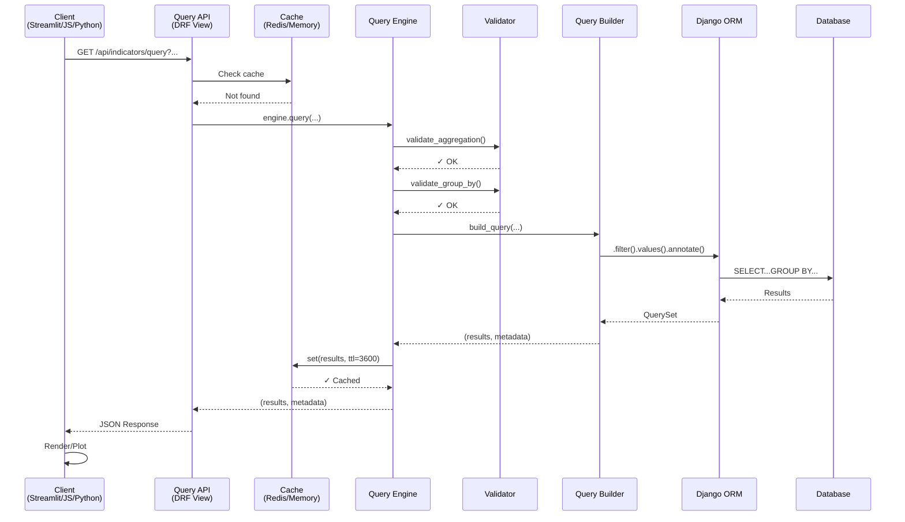
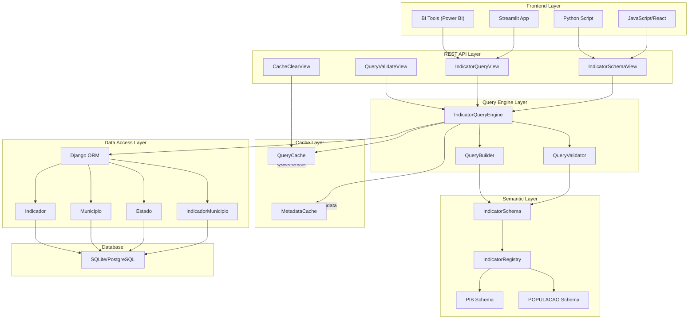
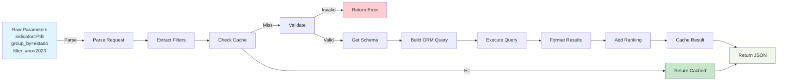
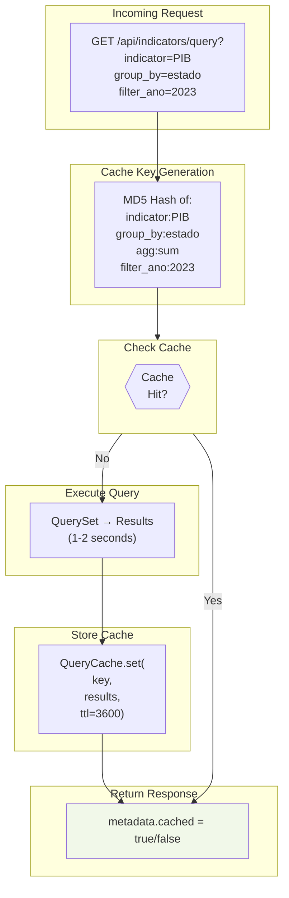
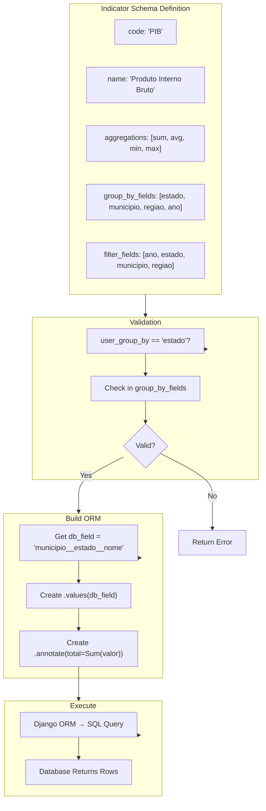
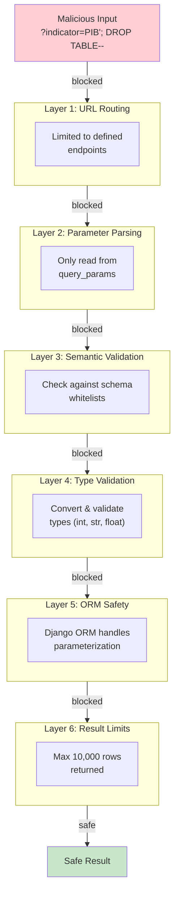
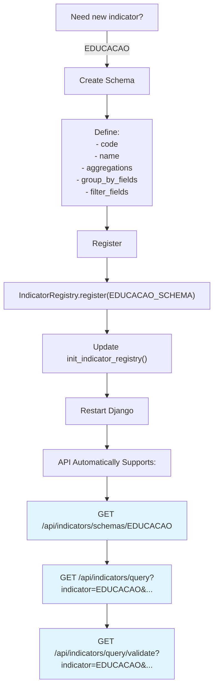
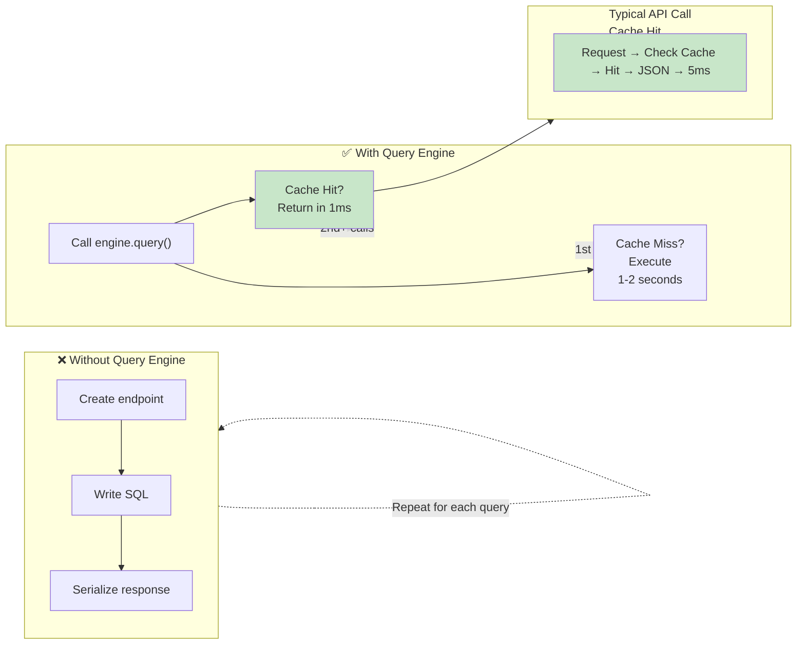
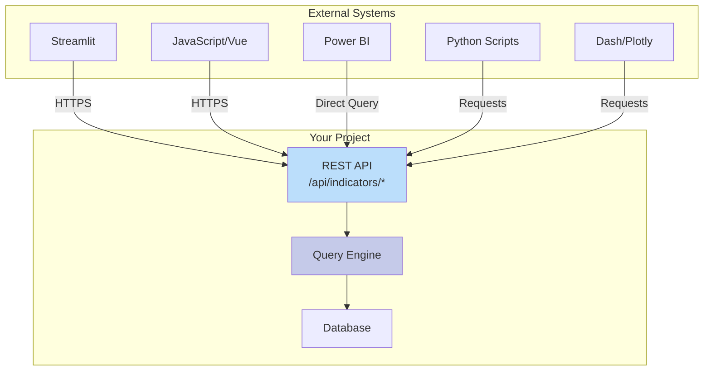

# Visual Architecture Diagrams

All diagrams in Mermaid format.

---

## Complete Data Flow

---

## Component Architecture

---

## Query Processing Pipeline

---

## Caching Strategy

---

## Semantic Model: How It Works

---

## Security: Multi-Layer Protection

---

## Query Builder: ORM Construction

```mermaid
graph LR
    A["Parameters:<br/>indicator=PIB<br/>group_by=estado<br/>agg=sum<br/>filter_ano=2023"] -->|1. Get Base| B["IndicadorMunicipio.objects"]
    
    B -->|2. Filter Indicator| C["filter(indicador__codigo=PIB)"]
    
    C -->|3. Filter Time| D["filter(ano=2023)"]
    
    D -->|4. Group & Aggregate| E["values('municipio__estado__nome')<br/>.annotate(total=Sum('valor'))"]
    
    E -->|5. Order| F["order_by('-total')"]
    
    F -->|6. Paginate| G["[0:1000]"]
    
    G -->|7. Execute| H["QuerySet → SQL"]
    
    H -->|8. Format| I["List of Dicts<br/>[{estado: SP, total: 2.1B}, ...]"]
    
    style I fill:#f1f8e9
```

---

## Adding a New Indicator: Step by Step

---

## Performance: From Slow to Fast

---

## Integration Points

---

**Want to understand the code deeper? Start with ARCHITECTURE.md**
